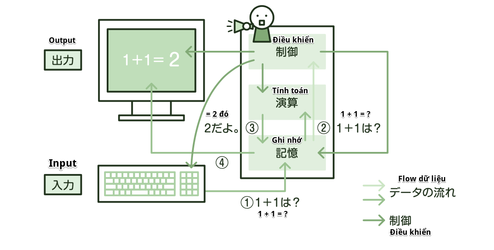

### Computer là gì?
Ngày nay, Computer (máy tính) được sử dụng trong hầu hết các thiết bị điện tử thông dụng như PC, máy chơi game, điện thoại di động,...  
Vậy thì, vốn dĩ Computer là gì?  
Computer là cỗ máy làm thay cho con người chúng ta nhiều việc như thực hiện tính toán số lượng lớn, hay xử lý những dữ liệu phức tạp,... Nhờ có máy tính, chúng ta tác nghiệp dễ dàng hơn, xử lý công việc một cách hiệu quả.

### Hardware và Software
Yếu tố cấu thành máy tính được chia ra làm 2 loại lớn là Hardware (phần cứng) và Software (phần mềm). Để máy tính hoạt động được, cần phải có cả hai thứ này.  
Phần cứng là những thứ mang tính vật chất như màn hình, bàn phím. Phần mềm là chương trình hoạt động bên trong máy tính.

### Các loại phần cứng
Trước tiên, ta sẽ đi vào giải thích về phần cứng.  
Máy tính cần có 5 loại phần cứng là: thiết bị nhập vào, thiết bị ghi nhớ, thiết bị điều khiển, thiết bị tính toán và thiết bị xuất ra.

<Các loại phần cứng>  

<table>
    <tr>
        <th>Thiết bị</th>
        <th>Vai trò</th>
        <th>Ví dụ</th>
    </tr>
    <tr>
        <td>Thiết bị nhập vào</td>
        <td>Kết nối với phần chính của máy tính, nhập vào dữ liệu hay chương trình</td>
        <td>Bàn phím, chuột</td>
    </tr>
    <tr>
        <td>Thiết bị ghi nhớ</td>
        <td>Lưu lại dữ liệu hay chương trình đã được nhập vào. Thường đặt ở bên trong phần chính của máy tính</td>
        <td>Bộ nhớ, ổ đĩa cứng</td>
    <tr>
        <td>Thiết bị điều khiển</td>
        <td>Lấy mệnh lệnh chương trình từ thiết bị ghi nhớ ra rồi diễn giải, điều khiển những phần cứng khác</td>
        <td rowspan="2">CPU</td>
    </tr>
    </tr>
        <td>Thiết bị tính toán</td>
        <td>Theo mệnh lệnh của chương trình, thực hiện tính toán đối với những dữ liệu đã lấy ra từ thiết bị ghi nhớ</td>
    <tr>
        <td>Thiết bị xuất ra</td>
        <td>Hiển thị, in ra cho con người có thể thấy được những dữ liệu đã được tính toán bên trong phần chính của máy tính</td>
        <td>Màn hình, máy in</td>
    </tr>
</table>

Dưới đây là sơ đồ diễn tả dữ liệu di chuyển như thế nào giữa 5 thiết bị

### Nguyên lý hoạt động của máy tính
Máy tính ngày nay là do nhà toán học người Mỹ Neumann đề xướng, có những đặc điểm sau đây:

##### Phương thức chứa program
Là phương thức nạp trước chương trình (program) vào bộ nhớ chính, CPU sẽ vừa gọi ra vừa chạy lần lượt. Có thể thay đổi cả xử lý chạy nếu thay đổi chương trình bằng cách cho chương trình độc lập với phần cứng.Phương thức có lưu sẵn chương trình cũng được gọi là phương thức ghi nhớ chương trình (Stored program method)

※*Chỗ này thường ra này!*

    *Thuật ngữ*
    [プログラム格納方式] (Stored program method): nạp chương trình vào bộ nhớ chính, CPU vừa gọi ra vừa chạy lần lượt

※*Thử thách với bài test*

    (Fundamental Information Technology Engineer Examination　Mùa xuân năm Heisei 26)
    Phương thức CPU vừa gọi ra vừa chạy lần lượt chương trình đã được ghi vào bộ nhớ chính là gì?
    ア: 制御方式
    イ: アドレス指定方式
    ウ: 仮想記憶方式
    エ: プログラム格納方式
    → Answer: エ
    

